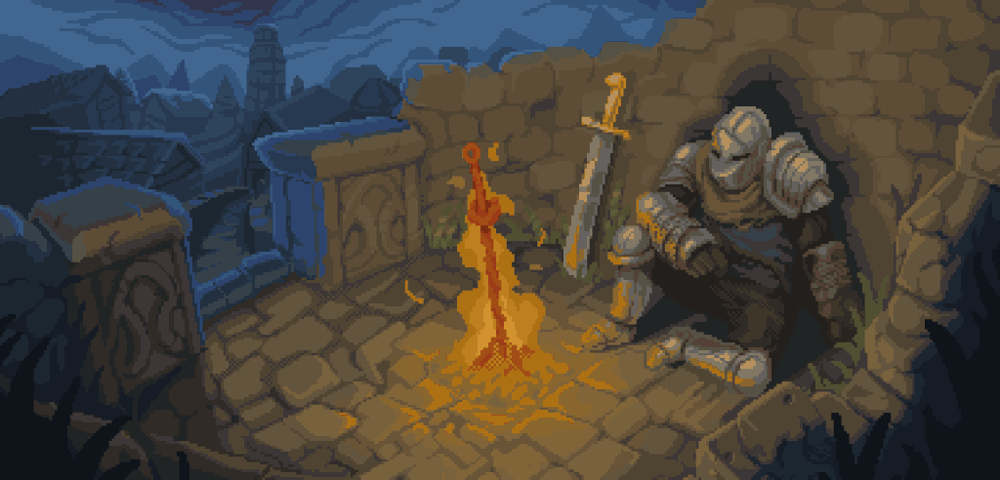

<body style="background-image: url('bc.gif'); background-repeat: repeat;">

<!-- <h1 align="center" style="color:#FBCC09;">ByMarko99 the Coding Ninja</h1>
 -->

<!-- Img creds: https://cannonbreed.newgrounds.com/
-->

**`Full Stack Developer (Developer/Creator/Bodybuilder)`**
### About Me
I am a self-driven full-stack developer and innovative content architect, crafting my unique digital universe with each endeavor. Every coding venture is meticulously constructed, starting with conceptualization and design, and culminating in the application of code to address real-world challenges. 

During my leisure hours, I engage in the art of bodybuilding, infusing both passion and professionalism into my fitness endeavors.

- 🔭 I’m currently working on developing my coding skills through intensive learning and completing my CV by training and achieving new certifications as a student.
- 🌀 I’m currently learning different frameworks such as Laravel, Blazor, or Angular.
- 🐱‍👤 Fun fact: I'm the coding ninja who combines keystrokes with kettlebells, mastering both the virtual and physical realms!
- ⛩️ Ask me about anything you want to!
- 📫 How to reach me: markoalmeida4@gmail.com

 

   
   
   
   

## 👨‍💻 Languages && Technologies

## 🐱‍👓 My workspace

## 📊 Stats

  
   

## 🤳 Social

## 🐱‍🚀 Donations

If you want to support my work, check the links below :)!

 
</body>
